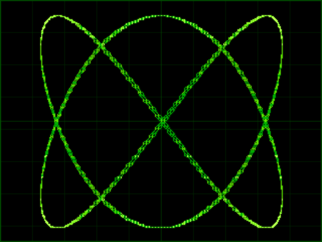
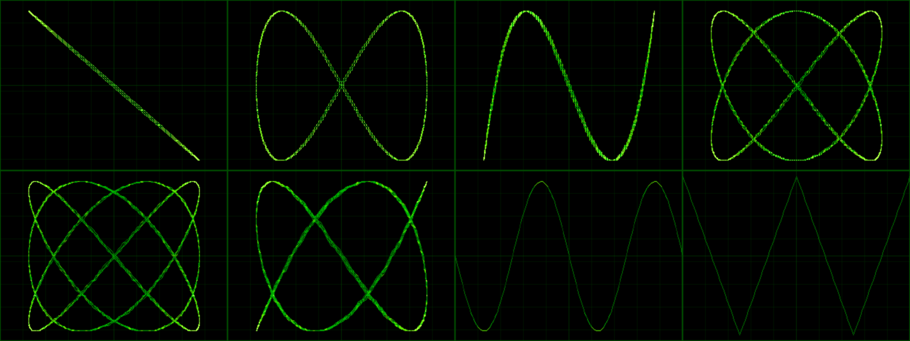
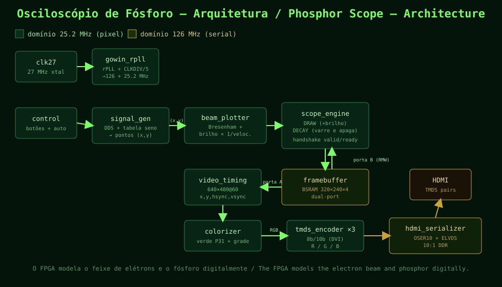

# 🟢 Phosphor Oscilloscope — Tang Nano 20K

[🇧🇷 Português](README.md) · **🇬🇧 English**

> A ~$25 FPGA that **becomes** a green-phosphor analog oscilloscope, straight out to your monitor over HDMI — no ADC, no extra board, no external SDRAM. Everything fits inside the chip.

<p align="center">
  
</p>

<p align="center">
  
</p>

*(The images above are produced by the **Python reference model** — `model/phosphor_model.py` — which uses the exact same math as the hardware. It is a faithful preview of what appears on screen.)*

---

## ✨ Why this makes makers think "why didn't I think of this before?"

Most FPGA-over-HDMI projects draw *color bars, squares, or Game of Life*. This one flips the idea:

> **The FPGA is not drawing an oscilloscope. The FPGA IS the oscilloscope.**
> In silicon, it models the two physical things that give a cathode-ray tube (CRT) its unmistakable beauty: **the electron beam** and **the phosphor that glows and cools down**.

And the detail almost nobody implements — the one that separates a "computer trace" from an "analog trace":

🔑 **Each point's brightness is proportional to how long the beam dwells there (Z-axis modulation).**
In a real CRT, where the beam is slow it deposits more energy and the phosphor glows brighter — which is why the *turning points* of a Lissajous figure are dazzling and the fast stretches are faint. Here we measure each segment's "length" and light the pixel with brightness **∝ 1/speed**. That is what makes the result look like a 1970s Tektronix, not a GIF.

Add **phosphor decay** (a continuous sweep that slowly dims the screen) and you get that *afterglow* — the trail that lingers and fades smoothly.

---

## 🧠 How it works (overview)

<p align="center">
  
</p>

The signal flows down an assembly line (pipeline):

1. **`gowin_rpll`** — from the 27 MHz crystal it generates **25.2 MHz** (pixel clock) and **126 MHz** (5× for the TMDS serializer).
2. **`signal_gen`** — a **DDS** (direct digital synthesis) with a sine table produces the (x,y) points the beam should follow. Changing the X:Y frequency ratio yields the **Lissajous** figures.
3. **`beam_plotter`** — joins points with lines via **Bresenham** (adds only!) and computes **brightness ∝ 1/speed**.
4. **`scope_engine`** — owns the image memory. It does two things at once: **DRAW** (add brightness where the beam passes) and **DECAY** (sweep the whole memory subtracting 1 — the phosphor cooling down).
5. **`framebuffer`** — 320×240 with 4-bit intensity per pixel, **inside the FPGA's BSRAM** (no external SDRAM!). Read by the video stage and scaled 2× to 640×480.
6. **`colorizer`** — turns intensity into **P31** green phosphor and draws the **graticule** (the scope grid).
7. **`tmds_encoder` ×3 + `hdmi_serializer`** — **8b/10b (DVI)** encoding and **OSER10 + ELVDS** serialization to the HDMI differential pairs.

📖 **Want the why and the math behind each block?** Read [`docs/theory_en.md`](docs/theory_en.md).

---

## 🛠️ Required hardware

- **Sipeed Tang Nano 20K** (Gowin `GW2AR-LV18QN88C8/I7` FPGA).
- An **HDMI cable** and a monitor/TV that accepts **640×480 @ 60 Hz** (virtually all do).
- That's it. **No** external parts, ADC, or signal source — the generator is internal.

---

## 🚀 Build & flash

### Option A — Open-source tools (recommended, scriptable)

Install the [OSS CAD Suite](https://github.com/YosysHQ/oss-cad-suite-build) (`yosys`, `nextpnr-himbaechel`, `apicula`/`gowin_pack`, `openFPGALoader`). Then:

```bash
make            # builds build/top.fs
make flash      # program SRAM (gone on power-off)
make flash-spi  # program SPI flash (persistent)
```

### Option B — Official Gowin IDE

1. Create a project for device `GW2AR-LV18QN88C8/I7`.
2. Add every `src/*.v` file and the `src/sine_lut.hex` table.
3. Add the `constraints/tangnano20k.cst` and `constraints/tangnano20k.sdc` constraints.
4. Set `top` as the top module, synthesize, place & route, and program.

> ⚠️ **HDMI/button pins:** the numbers in `tangnano20k.cst` are the most common ones, but **may vary by board revision**. If the screen stays black, check against the [official Sipeed example](https://github.com/sipeed/TangNano-20K-example) and the schematic.

---

## 🎮 Controls

The project is **autonomous**: on power-up it starts drawing and **changes figure on its own every ~6 seconds**. The two on-board buttons let you interact:

| Button | Action |
|--------|--------|
| **BTN0** (S1) | Next figure now |
| **BTN1** (S2) | Toggle auto-cycling |

The **LEDs** show status: PLL lock, auto mode, and the current figure number.

The 8 figures: `Lissajous 1:1`, `1:2`, `1:3`, `2:3`, `3:4`, `3:5`, and two **YT mode** (time) traces — `sine` and `triangle` — with **triggering** so the wave stands still on screen.

---

## 🔬 Simulation & tests (all verified!)

You **don't need the FPGA** to confirm the logic is correct. Every block has an Icarus Verilog testbench:

```bash
sudo apt install iverilog     # if you don't have it
make sim                      # or:  cd sim && ./run.sh
```

| Testbench | What it proves |
|-----------|----------------|
| `tb_video_timing` | Counts 800×525 cycles/frame, 640×480 active pixels, and the sync width (96/line). |
| `tb_signal_gen` | Every sample lands inside the framebuffer and each figure really varies. |
| `tb_tmds_encoder` | **Round-trip** (encode→decode recovers the original byte) over 8256 symbols + bounded **DC balance**. |
| `tb_scope_engine` | Draws a segment at the right brightness and the **decay** brings the pixel back to 0. |
| `tb_top_smoke` | Integrates everything: video runs with no `X`, syncs toggle, TMDS valid. |

Expected output: **`RESULTADO / RESULT: 4 PASS, 0 FAIL`**.

> 💡 Bonus: `model/phosphor_model.py` is a Python **reference model** reproducing the same math and generating this README's images. Run `make preview` to regenerate them.

---

## 📁 Project layout

```
tn20k-phosphor-scope/
├── src/                  # RTL (Verilog) — the heart of the project
│   ├── top.v             # top: wires all blocks together
│   ├── gowin_rpll.v      # PLL: 27 → 126 / 25.2 MHz  (Gowin primitives)
│   ├── video_timing.v    # 640x480@60 sync generator
│   ├── control.v         # buttons + auto-cycling
│   ├── signal_gen.v      # DDS: generates the points (Lissajous / YT)
│   ├── sine_lut.v        # sine table (+ sine_lut.hex)
│   ├── beam_plotter.v    # Bresenham + brightness ∝ speed
│   ├── scope_engine.v    # draw + decay of the phosphor
│   ├── framebuffer.v     # BSRAM 320x240x4 dual-port
│   ├── colorizer.v       # P31 green + graticule
│   ├── tmds_encoder.v    # 8b/10b (DVI) — pure logic, testable
│   └── hdmi_serializer.v # OSER10 + ELVDS  (Gowin primitives)
├── sim/                  # testbenches + run.sh
├── model/               # Python reference model + previews
├── constraints/         # .cst (pins), .sdc (timing), clocks.py (OSS)
├── docs/                # detailed theory (PT/EN) + diagrams
├── Makefile             # OSS flow + sim + preview
└── README.en.md
```

---

## 🧪 Play with the parameters (didactic mini-exercises)

Almost everything is parameterized. Try it and watch the screen:

- **Phosphor persistence** — in `scope_engine.v`, decay subtracts 1 per sweep. Make it subtract 1 every *N* sweeps for a **longer** trail (like a radar P7 phosphor), or increase it to fade faster.
- **Figure speed** — in `signal_gen.v`, `STEP` controls beam speed; `SLOW_BITS` controls how slowly the *morph* rotates the figure.
- **Framebuffer resolution / color depth** — `framebuffer.v` uses 4 bits (16 levels). Go to 5–6 bits for smoother gradients (watch BSRAM usage).
- **New figures** — add X:Y ratios to the table in `signal_gen.v` and create your own Lissajous.
- **Phosphor color** — `colorizer.v` makes P31 green. Swap it for P3 amber or P4 blue-white.

---

## ❓ Troubleshooting

- **Black screen / "no signal":** almost always the **HDMI pins** in the `.cst` (see the warning above) or a monitor that won't accept 640×480. Check the LEDs: if the PLL won't lock, review the 27 MHz clock (pin 4).
- **Image shakes / wrong colors:** check the differential-pair polarity; some cables/boards swap P/N.
- **Buttons do nothing:** the project works without them (auto-cycling). Verify the `btn_n` pins in the `.cst`.
- **`make` fails at `nextpnr`:** use a recent OSS CAD Suite — Gowin support (`himbaechel`) evolves quickly.

---

## 📜 License

[MIT](LICENSE) — use, modify, teach, and share freely.

---

## 🙌 Credits & references

Original project. Built on public knowledge of: the **DVI/TMDS** spec, **Gowin** primitives (rPLL, CLKDIV, OSER10, ELVDS_OBUF), the **OSS** flow (Yosys + nextpnr-himbaechel + apicula), and **Sipeed's** Tang Nano 20K examples.

If this made you smile, drop a ⭐ and show your phosphor glowing. 🟢
